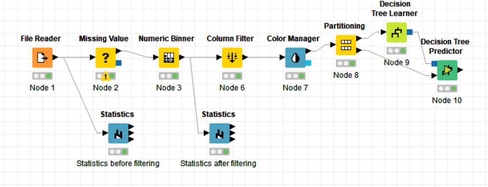
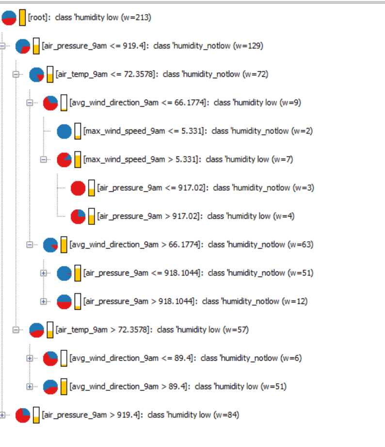
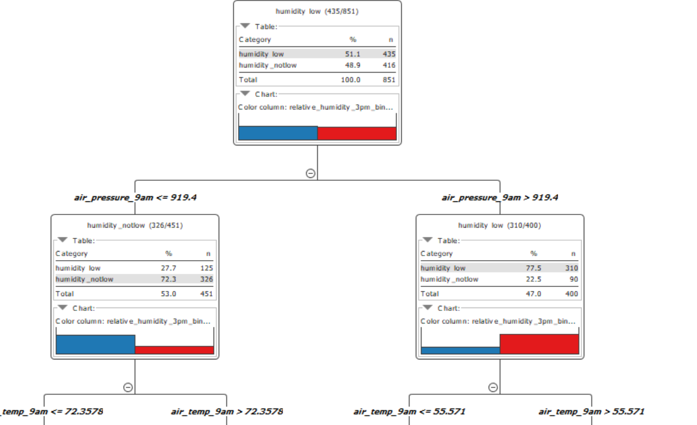

# decision-tree-in-KNIME-
creation of a decision tree in KNIME to analyse a sample data 

the above is the flow path used for the analysis

##results 

Looking at the root node (the top node), we see that there 851 samples in total. Of these, 435 or 51.1% of the samples are labeled as humidity_low; that is, the true label of these samples is humidity_low. Of the total number of samples, 416 or 48.9% are labeled as humidity_not_low. So at the root node, approximately half of the samples are humidity_low and half are humidity_not_low. This is indicated by the color bars at the bottom of the root node: blue is for humidity_not_low, and red is for humidity_low, and the height of each bar specifies the percentage of samples labeled with the respective category.
